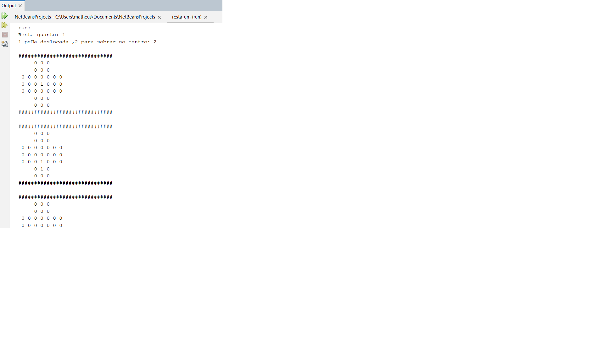

<h1 align="center"> Meu site </h1>

Meu primeiro site feito para critérios de divulgação.

  <a href="#-tecnologias">Tecnologias</a>&nbsp;&nbsp;&nbsp;|&nbsp;&nbsp;&nbsp;
  <a href="#-projeto">Projeto</a>&nbsp;&nbsp;&nbsp;|&nbsp;&nbsp;&nbsp;
  <a href="#-layout">Layout</a>&nbsp;&nbsp;&nbsp;|&nbsp;&nbsp;&nbsp;
  <a href="#memo-licença">Licença</a>

  

 

  

##  Tecnologias

Esse projeto foi desenvolvido com as seguintes tecnologias:

- Java

## 💻 Projeto

Algoritmo em Java feito para jogar o jogo Resta um com uso de força bruta com métodos recursivos.

